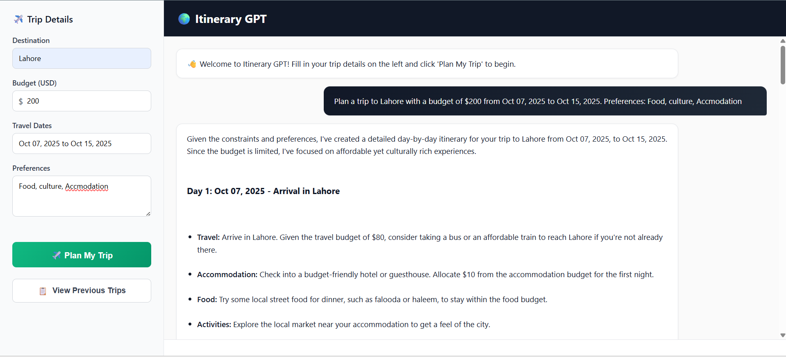

# 🌍 AI Travel Planner API

The **AI Travel Planner API** is a FastAPI-based backend designed to generate personalized travel plans, manage trip conversations, and store chat histories.  
It supports full Docker deployment, making it lightweight, portable, and easy to host anywhere.

---



## 🚀 Features

✅ Generate AI-powered travel itineraries  
✅ Save and retrieve previous trip chats  
✅ Delete past trip records  
✅ Serve frontend (HTML interface) directly via FastAPI  
✅ Fully containerized with **Docker** for easy deployment  

---

## 🧠 Tech Stack

| Component | Technology |
|------------|-------------|
| Backend Framework | **FastAPI** |
| Server | **Uvicorn** |
| AI Integration | **LangGraph / Tavily API** |
| Containerization | **Docker** |
| Database | Local storage / checkpoint system |
| Language | **Python 3.11+** |

---

## 🏗️ Project Structure

travelapi/
├── api.py # Main FastAPI app (routes and endpoints)

├── app.py # Core logic (chatbot, data retrieval, deletion)

├── requirements.txt # Python dependencies

├── Dockerfile # Docker setup file

├── interface/ # (Optional) Frontend interface files (HTML, CSS, JS)

└── README.md # Project documentation


---

## ⚙️ Installation (Run Locally)

### 1️⃣ Clone the Repository
```bash
git clone https://github.com/muhammadafaqkhan/travelapi.git
cd travelapi
```

## 2️⃣ Install Dependencies
```
pip install -r requirements.txt
```
## 3️⃣ Run the API
```
uvicorn api:app --host 0.0.0.0 --port 8000
```


